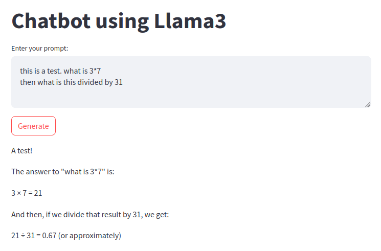

# KP digital humanities group 5
This repo contains some scripts to play around with open source text models (mainly Llama-3-8B).

## llama streamlit app
To execute this simple app setup a new virtual environment then (for linux) run 

```bash
pip install -r requirements.txt
curl -fsSL https://ollama.com/install.sh | sh
ollama pull llama3 # can be any other model available
```

if you run the app using `streamlit run llama.py` your app should look like this:


