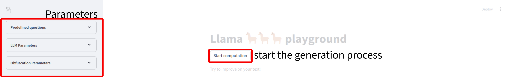
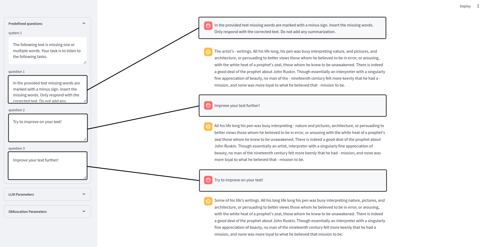

# KP digital humanities group 5
This repo contains some scripts to play around with open source text models (mainly Llama-3-8B).

## llama streamlit app
To execute this simple app setup a new virtual environment then (for linux) run 

### download this project
```bash
git clone https://github.com/FlorianMehnert/kp_digital_humanities.git dh_5
cd dh_5
```

### setup and activate your python venv
```bash
python -m venv dh_5
source dh_5/bin/activate
```

### install requirements
```bash
pip install -r requirements.txt
curl -fsSL https://ollama.com/install.sh | sh
ollama pull llama3
```

### run any streamlit app
```bash
streamlit run st_llama_v6.py
```

if you run the app using `streamlit run llama.py` your app should look like this:


upon entering the start computation button the llm tries to answer your predefined questions based on the paragraphs in the original text.

questions entered in the sidebar are answered one by one upon finishing the current generation process

